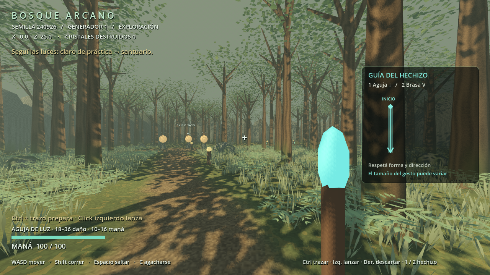
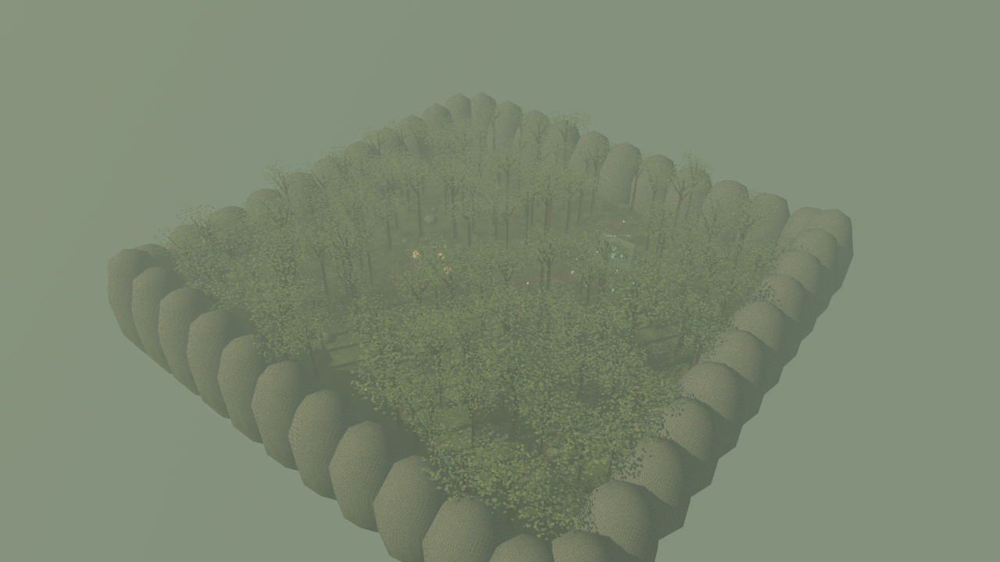

# Bosque Arcano — prototipo 0.2

Exploración y magia ofensiva en primera persona, Godot 4.4.1 + GDScript. Esta versión agrega preparación por gestos, disparo con click, mejora visual del bosque y destrucción básica de árboles y rocas. El núcleo de investigación matemática distribuida sigue pendiente.

## Jugar

Abrí **Jugar.cmd** y elegí **ENTRAR / CONTINUAR**. Mantené **Ctrl** y mové el mouse hacia abajo. Al soltar Ctrl queda preparada una Aguja de Luz: podés volver a apuntar y **click izquierdo** la dispara. **Click derecho** descarta la carga o cancela el trazo. Seguí las luces hasta los cristales ámbar para practicar. Con **2**, prepará una V de izquierda a derecha para Brasa Rúnica.

Jugar.cmd usa Forward+ con niebla volumétrica. **Jugar-ligero.cmd** usa Compatibility con el mismo bosque y mecánicas, sin niebla volumétrica ni SSAO. Se probaron ambos en la GTX 1070 del equipo; la primera compilación de shaders puede demorar.

Los accesos usan el motor portátil ya existente en `../duelo-arcano/tools/godot/`; no duplican ni modifican el juego anterior. Si movés este proyecto sin esa carpeta, importá `project.godot` con Godot 4.4.1. El código del juego no depende de scripts del prototipo anterior. **Editar.cmd** abre el editor.

| Acción | Control |
|---|---|
| Caminar / mirar | WASD / mouse |
| Correr / agacharse | Shift / C |
| Saltar | Espacio |
| Dibujar el gesto | Mantener Ctrl y mover el mouse |
| Preparar el hechizo | Soltar Ctrl; todavía no dispara ni gasta maná |
| Lanzar la carga | Click izquierdo; un gesto permite un disparo |
| Cancelar trazo / descartar carga | Click derecho o Q |
| Seleccionar hechizo | 1 Aguja / 2 Brasa; cambiar descarta la carga |
| Pausa y menú | Esc |
| Volver al inicio | F5 |
| Pantalla completa | F11 |
| Sensibilidad, seed y regeneración | Menú |

## Incluido

- Bosque limitado a **64 × 64 metros**, dos claros, sendero conectado, santuario y marcadores de orientación.
- **Colinas suaves** (rama `claude/terreno-alturas`, sin verificar todavía en la PC): mapa de alturas de 3 × 3 sectores de 22 m, muestras cada 0,5 m, malla y `HeightMapShape3D` por sector con bordes compartidos. Claros, santuario y spawn nivelados; el claro de práctica es la altura 0. Ver `docs/TERRENO.md`.
- **Cráteres** (misma rama, sin verificar en la PC): un impacto de Brasa Rúnica sobre el suelo abre un cráter de 2,2 m de radio y 0,6 m de profundidad; impactos repetidos lo profundizan hasta ~1,2 m con paredes caminables. Solo se reconstruyen los sectores afectados y los objetos cercanos bajan con el suelo. El santuario y la franja junto a los límites no se excavan. Los cráteres viven en memoria: regenerar o cerrar los borra.
- **155 árboles y 28 rocas** en la semilla inicial; colocación con separación mínima y zonas reservadas para circulación. Árboles, rocas y límites tienen colisiones.
- La seed cambia la distribución, tamaños de vegetación, rocas y algunos puntos del sendero. Los claros y los lugares de práctica siguen en posiciones conocidas. Es un bosque acotado, no un generador de biomas ni terreno infinito.
- Misma seed + reglas/versión del generador + motor reproducen la descripción del mundo. El menú permite repetir una seed o elegir otra. Seed inicial: `240926`.
- Movimiento con salto, carrera, agachado y comprobación volumétrica de espacio para levantarse.
- **Aguja de Luz:** línea descendente, daño 18–36, maná 16–10, velocidad 34 m/s, cooldown 0,28 s.
- **Brasa Rúnica:** V desde arriba a la izquierda hacia abajo y luego arriba a la derecha, daño 26–52, maná 24–16, velocidad 22 m/s, cooldown 0,55 s.
- Mayor precisión da más daño y menor consumo. Vida de proyectil 2,5 s; colisión de punto sobre todo el segmento recorrido por tick.
- Durante el trazo WASD, carrera y salto siguen activos. El mouse deja de girar la cámara hasta soltar Ctrl. No se cambia la escala de tiempo. La rapidez depende de ejecución humana; no hay una animación de carga obligatoria.
- Una carga preparada conserva su calidad y permite apuntar de nuevo. El disparo utiliza la cámara en el instante del click. El maná se descuenta al disparar. Se puede preparar durante cooldown, pero no disparar hasta que termine.
- Se admite una sola carga, sin acumulación. Pausa, pérdida de foco, cambio de hechizo, respawn, regeneración, Q o click derecho la descartan. Empezar un nuevo trazo reemplaza la carga anterior.
- Maná máximo 100, regeneración de 18/s después de 0,8 s sin lanzar; feedback visual de lanzamiento e impactos.
- Tres cristales de práctica con 90 de vida y respawn a los 3 s. No atacan al jugador.
- Árboles de 90 de vida y rocas de 60 de vida reciben daño de los hechizos. Al romperse se retiran visuales y colisiones. Los IDs destruidos se registran en memoria; regenerar o cerrar restaura el bosque. Aún no hay fragmentos físicos, caída de árboles, drops ni guardado de destrucción.
- Árboles ramificados con follaje, pasto y helechos con viento, materiales procedurales de corteza/suelo/roca, iluminación filtrada, estelas e impactos. Vegetación repetida agrupada por sectores con MultiMesh. Mayor densidad de detalle en el primer tramo, aproximadamente 24 × 23 metros.
- Menú, HUD, sensibilidad de mouse, pausa al perder foco, regeneración sin acumular mapas o proyectiles.

## Arquitectura

| Archivo | Responsabilidad |
|---|---|
| `scripts/world_generator.gd` | Generación de una descripción serializable; no crea nodos ni conoce combate. RNG separado para layout, árboles y rocas. |
| `scripts/forest.gd` | Convierte la descripción en geometría, colisiones y señales del camino; apoya cada objeto en el terreno. |
| `scripts/terrain.gd` | Malla y colisión por sector a partir de las alturas; reconstruye solo los sectores editados. |
| `scripts/terrain_edit.gd` | Excavación pura de cráteres sobre las alturas (milímetros enteros), con límite de pendiente. |
| `scripts/explorer.gd` | Movimiento y cámara, con bloqueo explícito de orientación durante trazos. |
| `scripts/gesture_caster.gd` | Entrada Ctrl/mouse, estados de trazado/carga, cancelación y solicitud de lanzamiento. |
| `scripts/gesture_math.gd` | Evaluación pura por forma y dirección, independiente de escena y combate. |
| `scripts/spell_catalog.gd` | Balance y traducción de precisión a daño/costo. |
| `scripts/magic_combat.gd` | Lanzamiento, maná, cooldown, trayectorias e impactos. |
| `scripts/gesture_overlay.gd` | Guía del gesto, trazo actual y estado de carga. |
| `scripts/forest_assets.gd` | Mallas originales compartidas de árboles, pasto y helechos. |
| `scripts/destructible_prop.gd` | Vida, retirada y evento de destrucción de objetos. |
| `scripts/practice_target.gd` | Vida, destrucción, respawn y eventos de daño del blanco. |
| `scripts/hud.gd` | Presentación y eventos del menú. Recibe datos explícitos. |
| `scripts/game.gd` | Conecta componentes, crea el mundo y coordina pausa/regeneración. |
| `scripts/visuals.gd` | Geometría provisional reutilizable. |

El generador admite un contexto opcional como dato reservado; todavía no cambia el bosque por problemas matemáticos. `generator_version = 2` agrega las alturas con un flujo aleatorio propio; sendero, árboles y rocas conservan exactamente las posiciones x/z de la versión 1 (lo comprueba `tests/terrain_tests.gd`). Motor de referencia 4.4.1. Los nuevos assets cambian apariencia y altura de troncos, conservando las posiciones y corredores. Su fingerprint describe la distribución, no una equivalencia de render ni de física entre versiones del juego.

La evaluación del gesto remuestrea 32 posiciones por distancia recorrida. Ignora traslación y tamaño uniforme, conserva sentido y proporción; penaliza desviaciones y retrocesos. Umbral de aceptación: 55 %. Recorridos mínimos: 45 px para Aguja y 75 px para Brasa; límite: 1600 px/2048 muestras. El resultado se muestra como porcentaje de ajuste a la plantilla, no como probabilidad de acertar al enemigo. El tiempo se informa, pero no suma daño por sí solo. Ver GESTOS-Y-MUNDO.md.

La auditoría anterior y la arquitectura completa están en `docs/ARQUITECTURA-RPG-MAGIA.md`. Se eligió un proyecto nuevo con portado selectivo de movimiento, geometría y técnica de colisión de proyectiles; no se transformó la escena de práctica del shooter.

## Verificación

**Verificar.cmd** ejecuta 40 comprobaciones de mundo/combate, 27 de gestos/carga, 8 de destrucción, 39 de terreno y 19 de cráteres: **133 comprobaciones sin ventana**.

`tests/capture.gd` agrega 23 comprobaciones gráficas con input: cámara, movimiento durante trazo, preparación sin disparo, nueva puntería al lanzar, ambos hechizos, cancelación por click derecho y pausa. Total: **156 comprobaciones**. Con el terreno y los cráteres, `capture.gd` todavía no se ejecutó (requiere GPU). También genera capturas reales del bosque y las guías. Ver `VERIFICACION.md`.

## Alcance y continuación

El mapa tiene colinas suaves por mapa de alturas y límites fijos de 64 × 64 m, con cráteres en memoria; todavía no hay guardado, streaming ni biomas. El arte usa mallas y materiales originales generados por código; es una aproximación de ambiente de bosque, no una reproducción del acabado de la referencia. No se descargaron assets ni se incorporaron modelos de Blender.

La destrucción actual cubre árboles y rocas distribuidos por el generador, y cráteres en el suelo (solo Brasa Rúnica). Santuario, límites y vegetación decorativa siguen sin destrucción. No hay cuevas, derrumbes, streaming de terreno, biomas, guardado de partida/ajustes, inventario, recolección, creación de recetas, enemigos hostiles, motor de investigación, lineage ni multiplayer. La sensibilidad, seed y destrucción se reinician al cerrar.

Nueva prioridad del usuario: mundo natural con desniveles y destrucción del entorno, sin construcción de bloques. Propuesta de siguiente incremento: una región pequeña de terreno volumétrico suave con colinas y cráteres persistentes, antes de extenderla por streaming. El plan está en GESTOS-Y-MUNDO.md. La investigación matemática y la creación de recetas siguen por definir.

Repositorio privado: `matiasstr/bosque-arcano`. La bitácora de sesiones está en `CLAUDE.md`.
